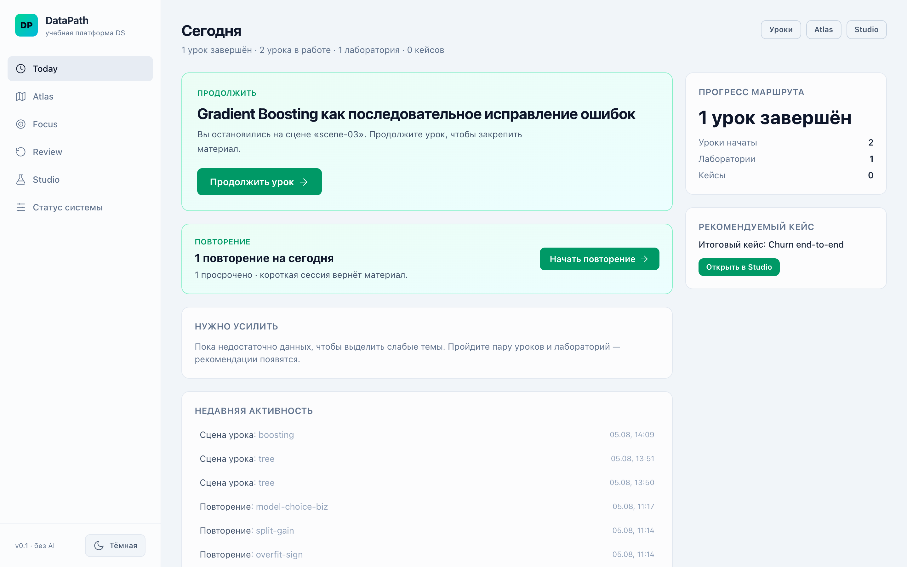
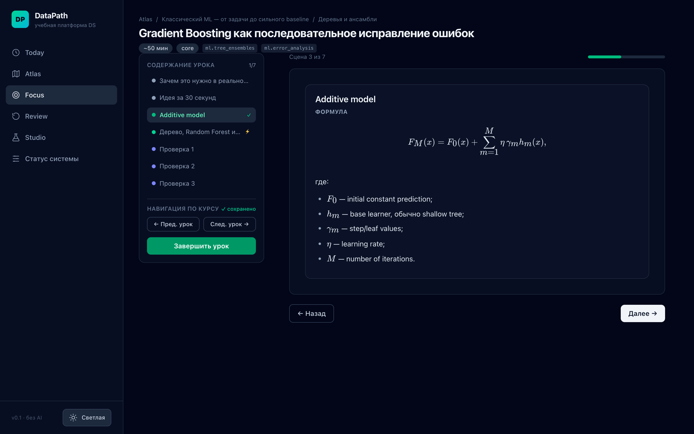
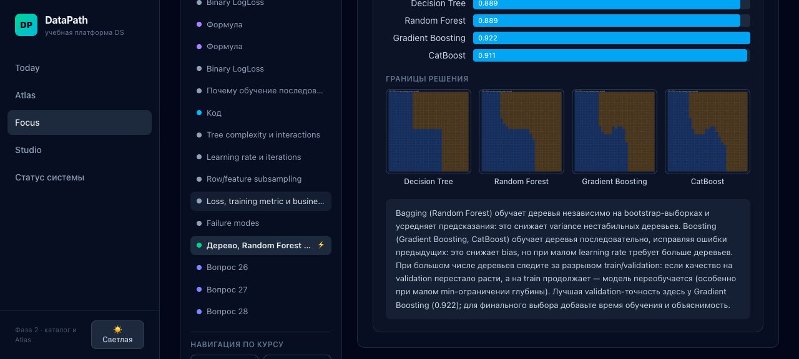

# DataPath

DataPath — локальная учебная платформа по Data Science, Machine Learning и Deep Learning. Она
объединяет связный маршрут, содержательные русскоязычные уроки, интерактивные объяснения,
практику и интервальное повторение. Аккаунт, облако и внешний AI API не требуются.

Текущая стабильная версия: **1.0.0**.

## Что внутри

- 86 уроков в основном маршруте: Python, NumPy/pandas, Math/Statistics, SQL/scikit-learn,
  Classic ML, Deep Learning, NLP, LLM/RAG и MLOps. В каноническом vault хранится 103 урока.
- 57 зарегистрированных интерактивных visual demos — от broadcasting, regression и boosting до
  backpropagation, attention, RAG retrieval и model monitoring — плюс три ML-лаборатории.
- Studio с 15 упражнениями и 9 mini-cases. Шесть SQL-задач выполняются настоящим SQLite WASM
  прямо в приложении.
- Today формирует короткую ежедневную сессию из урока, практики и Review.
- Focus сохраняет раздел, заметки, проверки понимания и прогресс.
- Review использует интервалы повторения и factual, conceptual, code/error и case форматы.
- Atlas показывает темы спокойными блоками и рассчитывает состояние из реального mastery.
- Экспорт и импорт учебного состояния с версией схемы и проверкой целостности.

## Учебный путь

Roadmap устроен как три последовательных прохода:

1. **Ориентация** — Python и данные, SQL, постановка ML-задачи, честный split и первый baseline.
2. **Понимание** — математика, validation, классические модели, нейросети и Transformer.
3. **Применение** — end-to-end решения, NLP/RAG, воспроизводимость, serving и monitoring.

Открытие страницы не считается освоением. Mastery складывается из прохождения урока, проверок,
практики, ошибок и успешных повторов.

## Интерфейс

| Ежедневная сессия                                   | Режим Focus                                                |
| --------------------------------------------------- | ---------------------------------------------------------- |
|  |  |



## Web / PWA

**[Открыть DataPath PWA](https://novaekh.github.io/DataPath/)**

```bash
make sync-content
make build-web
```

Production bundle появляется в `frontend/dist`. После первой успешной загрузки PWA сохраняет
application shell, весь release snapshot и SQLite WASM для работы без сети.

GitHub Actions публикует production PWA в GitHub Pages из `main`. Hash routing и base-aware assets
позволяют открывать все экраны под repository subpath без отдельного backend.

### Установка PWA на iPhone

1. Откройте публичный адрес DataPath в Safari.
2. Нажмите **Поделиться** → **На экран «Домой»**.
3. Если Safari показывает переключатель **Открывать как веб‑приложение**, оставьте его включённым.
4. Нажмите **Добавить**, затем запускайте DataPath с домашнего экрана.

Для первого запуска нужна сеть: приложение сохранит shell, учебный snapshot и SQLite WASM. После
этого откройте несколько уроков и Studio, закройте приложение, включите авиарежим и убедитесь, что
они снова открываются. Учебный прогресс и заметки остаются локально на устройстве.

## macOS

**[Скачать DataPath 1.0.0 для Apple Silicon (DMG)](https://github.com/novaeKH/DataPath/releases/download/v1.0.0/DataPath_1.0.0_aarch64.dmg)**

```bash
make build-macos
```

Готовый unsigned bundle:
`desktop/src-tauri/target/release/bundle/macos/DataPath.app`. Он работает без Terminal и FastAPI.
Откройте DMG и перенесите `DataPath.app` в `/Applications`. Поскольку версия 1.0.0 не подписана и
не notarized, при первом запуске нажмите по приложению с удержанием Control, выберите **Открыть**,
затем подтвердите **Открыть**. Не отключайте Gatekeeper глобально.

## iPhone / iOS

```bash
make ios-open
```

Команда собирает и синхронизирует тот же frontend в Capacitor project, затем открывает
`frontend/ios/App/App.xcodeproj`. В Xcode нужно выбрать личную Development Team и физическое
устройство. Требуются полный Xcode, iOS 15+ и Apple signing.

## Development

Требования: Python 3.12, [uv](https://docs.astral.sh/uv/), Node.js 22 и npm. Для macOS bundle
дополнительно нужны Rust и системные зависимости Tauri.

```bash
make sync-content
make dev
```

Открыть `http://127.0.0.1:5173`.

Основные проверки:

```bash
make test
make lint
make validate-content
make build-web
make build-macos
make ios-sync
```

## Architecture

- `content/vault` — канонический source-backed контент.
- `backend` — authoring/dev runtime: sync, validation, dev API и генерация release snapshot.
- `frontend` — общая React/TypeScript application и local-first platform layer.
- `desktop/src-tauri` — тонкая оболочка macOS.
- `frontend/ios` — Capacitor iOS target с той же frontend codebase.
- `.github/workflows` — CI и deployment GitHub Pages.

Подробности: [архитектура](docs/architecture.md), [текущее состояние](docs/current-state.md) и
[инструкция по релизу](docs/release.md).

## Privacy

DataPath не содержит регистрации, аналитики, рекламы или telemetry SaaS. Учебное состояние,
заметки и история Review хранятся локально в WebKit/localStorage контейнере выбранной платформы.
Приложение не отправляет их на сервер. Пользователь сам управляет backup-файлами, созданными через
«Настройки».

## Sources and license

Редакционные источники и принципы атрибуции перечислены в
[карте источников](docs/content-reference-map.md). Тексты уроков написаны для DataPath и не
копируют исходные учебники или документацию.

Исходный код распространяется по [MIT License](LICENSE). Учебные материалы, datasets, названия
продуктов и сторонние assets не передаются автоматически под MIT; подробности — в
[уведомлении о контенте](CONTENT_NOTICE.md).

Algorithms не входит в scope версии 1.0.0: задачи остаются во внешнем AlgoPath; в DataPath
сохранена только будущая adapter boundary.
