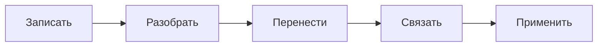

# Как пользоваться этим хранилищем

[[Главная|← На главную]]

## Структура

| Раздел | Что хранить |
|---|---|
| `00 Главная` | Главная панель и правила системы |
| `01 Входящие` | Быстрые записи, которые ещё не разобраны |
| `02 Ежедневные заметки` | Ход работы, учёбы и короткие итоги дня |
| `10 Знания` | Понятная теория, рабочие пайплайны и технические справочники |
| `20 Источники` | Книги, курсы, статьи и заметки по ним |
| `30 Мысли` | Собственные выводы, вопросы и гипотезы |
| `40 Проекты` | Действующие проекты и идеи продуктов |
| `50 Люди и идеи` | Люди, компании и связанные с ними идеи |
| `60 Карьера` | Подготовка к интервью, целевые компании и отклики |
| `90 Шаблоны` | Заготовки для новых заметок |
| `99 Вложения` | Изображения, PDF и другие файлы |

Материалы по ML теперь собраны в одном месте: `10 Знания/ML`. Внутри находится отдельная система [[Deep Learning — карта|Deep Learning]], пайплайны, основы, валидация и подготовка к собеседованиям.

## Один рабочий цикл

1. Быстро запиши мысль во [[Входящие]].
2. При разборе дай заметке название в форме понятного утверждения или вопроса.
3. Перенеси её в знания, источник, мысль или проект.
4. Добавь ссылку хотя бы на одну карту раздела.
5. Для учебной заметки добавь объяснение своими словами, минимальный пример, типичную ошибку и вопрос для самопроверки.

## Правила, которые сохраняют порядок

- Не создавай новые папки верхнего уровня без явной необходимости.
- Держи вложенность не глубже трёх смысловых уровней.
- Одна заметка — одна основная мысль или один рабочий сценарий.
- Папки отвечают на вопрос «где», ссылки — «с чем связано».
- Название должно быть понятно вне контекста папки.
- Вложения сохраняй только в `99 Вложения`.

## Статусы

| Статус | Значение |
|---|---|
| `inbox` | Ещё не разобрано |
| `seedling` | Основа есть, нужно развить |
| `active` | Используется сейчас |
| `complete` | Достаточно проработано |
| `archived` | Больше не активно |

## Еженедельное обслуживание — 10 минут

- [ ] Разобрать входящие.
- [ ] Проверить активные проекты и записать ближайший шаг.
- [ ] Связать новые знания с картами разделов.
- [ ] Удалить дублирующие задачи из заметок, оставив одно актуальное место.
- [ ] Архивировать то, что больше не требует внимания.

## Слой курсов DataPath

Раздел `05 Курсы` задаёт порядок, интерактив и практические сценарии. Он не является вторым хранилищем теории: каждый урок указывает `content_path` на canonical note в `10 Знания` или `15 Практика`. Новую теорию сначала добавляют в canonical owner, а затем подключают к одному или нескольким урокам.
