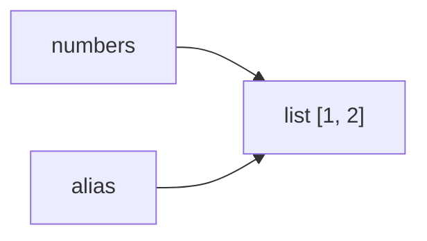

# 01. Объекты, ссылки и изменяемость

[[02_Как_решать_задачи_на_собеседовании|← Как решать задачи]] · [[02_List_Tuple_String|Следующий урок →]]

## Что нужно уметь

Предсказывать, увидит ли другая переменная изменение; отличать сравнение значений от идентичности; безопасно копировать вложенные структуры; объяснять передачу аргументов без фразы «по ссылке» или «по значению» как магического ответа.

## Переменная — имя, связанное с объектом

```python
numbers = [1, 2]
alias = numbers

print(id(numbers) == id(alias))  # True
print(type(numbers))             # <class 'list'>
```

`numbers` и `alias` — два имени одного списка. `id(obj)` идентифицирует объект в течение его жизни; не используйте `id` как бизнес-идентификатор. `type(obj)` возвращает тип объекта.



### `is` и `==`

- `a == b` спрашивает: «значения равны?»; вызывает `a.__eq__(b)`;
- `a is b` спрашивает: «это один объект?»;
- `is` правильно применять к singleton-объектам: `value is None`;
- интернирование малых чисел и строк — деталь реализации, на неё нельзя опираться.

```python
a = [1, 2]
b = [1, 2]
assert a == b
assert a is not b
```

## Изменяемые и неизменяемые объекты

Изменяемые: `list`, `dict`, `set`, большинство экземпляров пользовательских классов.  
Неизменяемые: `int`, `float`, `bool`, `str`, `bytes`, `tuple`, `frozenset`.

Операция над неизменяемым объектом создаёт новый объект и перепривязывает имя:

```python
text = "ml"
alias = text
text += "ops"
assert alias == "ml"
assert text == "mlops"
```

Метод изменяемого объекта меняет сам объект:

```python
numbers = [1]
alias = numbers
numbers.append(2)
assert alias == [1, 2]
```

## Срез и копии

`items[:]`, `list(items)` и `copy.copy(items)` создают новый внешний список, но оставляют ссылки на те же вложенные объекты. Это shallow copy — поверхностная копия.

```python
from copy import copy, deepcopy

source = [[1], [2]]
shallow = copy(source)
deep = deepcopy(source)

source[0].append(9)
assert shallow == [[1, 9], [2]]
assert deep == [[1], [2]]
```

`deepcopy` рекурсивно копирует граф объектов и учитывает циклы, но может быть дорогим и нежелательным для ресурсов вроде файлов и соединений. Копируйте ровно ту глубину, независимость которой действительно нужна.

### Ловушка вложенных списков

```python
bad = [[0] * 3] * 2
bad[0][1] = 7
print(bad)  # [[0, 7, 0], [0, 7, 0]]

good = [[0] * 3 for _ in range(2)]
good[0][1] = 7
print(good)  # [[0, 7, 0], [0, 0, 0]]
```

В `bad` внешний список содержит две ссылки на одну внутреннюю строку.

## Передача аргументов в функцию

Python передаёт функции ссылку на объект как значение (call by sharing). Функция получает новое локальное имя:

```python
def add_item(items: list[int]) -> None:
    items.append(10)  # изменяет общий объект

def replace(items: list[int]) -> None:
    items = [99]      # перепривязывает только локальное имя

values = [1]
add_item(values)
replace(values)
assert values == [1, 10]
```

`items += ...` зависит от типа: для списка это обычно in-place изменение, для tuple создаётся новый объект.

## Предскажите результат

```python
# A
x = [1, 2]
y = x
x = x + [3]
print(x, y)

# B
x = [1, 2]
y = x
x += [3]
print(x, y)

# C
a = ([1],)
b = a
a[0].append(2)
print(b)
```

<details>
<summary>Ответы</summary>

A: `[1, 2, 3] [1, 2]` — `+` создал новый список.  
B: оба имени видят `[1, 2, 3]` — `list.__iadd__` изменил объект.  
C: `([1, 2],)` — tuple неизменяем, но вложенный список изменяем.

</details>

## Вопросы с подвохом

1. Гарантирует ли `a is b`, что `a == b`? Обычно один объект равен себе, но пользовательский `__eq__` может нарушить ожидание.
2. Делает ли срез deep copy? Нет.
3. Можно ли изменить tuple? Нельзя заменить его элементы, но вложенный mutable-объект менять можно.
4. Уничтожает ли `del name` объект? Только удаляет имя; объект жив, пока есть сильные ссылки.

## Ответ интервьюеру за 30 секунд

> Переменная Python хранит не сам объект, а связывает имя с объектом. Присваивание второго имени не копирует объект. Поэтому in-place изменение списка видно через все ссылки, а переприсваивание одного имени — нет. `==` сравнивает значения, `is` — идентичность; `is` обычно нужен для `None`. Срез и `copy.copy` копируют только внешний контейнер, а для независимой вложенной структуры иногда нужен `deepcopy`.

## Мини-контрольная

1. Почему `[[0] * m] * n` опасно?
2. Чем `copy.copy` отличается от `copy.deepcopy`?
3. Что именно получает параметр функции?
4. Почему `tuple` может измениться «внутри»?
5. Создаёт ли `list.sort()` новый объект?

<details>
<summary>Короткие ответы</summary>

1. Повторяет одну ссылку на вложенный список. 2. Копирует внешний объект против рекурсивного копирования. 3. Новое локальное имя, связанное с переданным объектом. 4. Сам tuple прежний, изменяется вложенный mutable-объект. 5. Нет, сортирует на месте.

</details>

Связано: [[09_Память_GC_GIL]], [[12_Linked_List]], [[Code_Review_задачи]].
