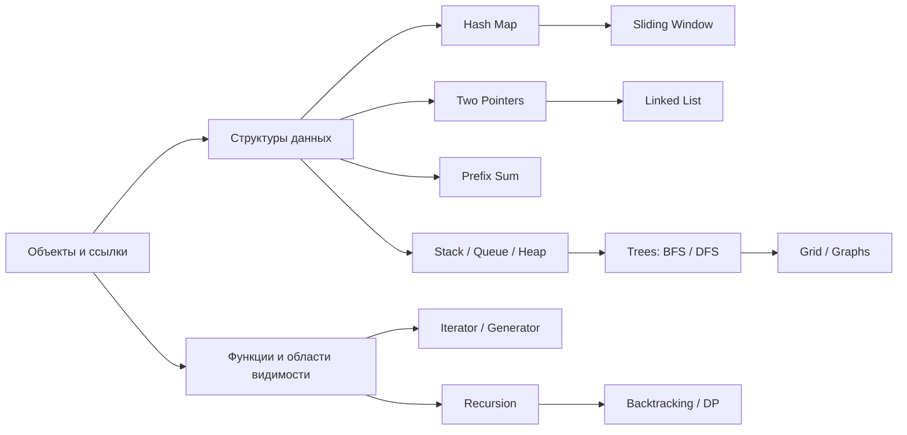

# Карта тем

[[00_Главная_страница|← Главная]]

| Сигнал или вопрос | Python Core | Алгоритм | Практика |
|---|---|---|---|
| «Почему другая переменная увидела изменение?» | [[01_Объекты_ссылки_и_изменяемость]] | — | CR 3–4 |
| «Уже встречался?», дедупликация | [[03_Dict_Set_Hash_Map]] | [[03_Hash_Map_и_Frequency_Map]] | 217, 349 |
| Частота, группировка, значение → позиции | [[03_Dict_Set_Hash_Map]] | [[03_Hash_Map_и_Frequency_Map]] | 242, 49, 387 |
| Сортированный массив, пара, in-place | [[02_List_Tuple_String]] | [[04_Two_Pointers]] | 125, 26, 88, 167 |
| Непрерывный фрагмент, максимум/минимум | [[10_Python_для_Data_Science]] | [[05_Sliding_Window]] | 643, 3, 1004, 209 |
| Много сумм по диапазонам | [[02_List_Tuple_String]] | [[06_Prefix_Sum]] | 1480, 724, 303, 560 |
| Монотонный предикат или сортировка | — | [[07_Binary_Search]] | 704, 35, 69, 278 |
| Последний открытый элемент, откат | [[06_OOP_и_магические_методы]] | [[08_Stack_Queue_Deque]] | 20, 1047 |
| Следующий больший элемент | — | [[09_Monotonic_Stack]] | 739 |
| Перекрывающиеся диапазоны | — | [[10_Intervals]] | 56, 57 |
| Top-K, поток, экстремум | [[10_Python_для_Data_Science]] | [[11_Heap_и_Top_K]] | 215, 347, 703 |
| Указатели-ссылки, цикл | [[01_Объекты_ссылки_и_изменяемость]] | [[12_Linked_List]] | 206, 141 |
| Все варианты выбора | [[04_Функции_и_области_видимости]] | [[13_Recursion_Backtracking]] | учебные локальные задачи |
| Уровни дерева / кратчайшее число шагов | [[08_Stack_Queue_Deque]] | [[14_Trees_BFS_DFS]] | 102, 994 |
| Компоненты, острова, заливка | [[03_Dict_Set_Hash_Map]] | [[15_Matrix_и_Grid]], [[16_Graphs]] | 200, 733 |
| Локально лучший выбор | — | [[17_Greedy]] | 121, 53 |
| Перекрывающиеся подзадачи | [[04_Функции_и_области_видимости]] | [[18_Dynamic_Programming_Basics]] | 70, 198, 322 |
| «Почему генератор экономит память?» | [[05_Iterable_Iterator_Generator]] | — | банк Python-вопросов |
| `len`, `in`, `obj[key]`, `with` | [[06_OOP_и_магические_методы]], [[07_Исключения_и_Context_Manager]] | — | CR 15 |
| CPU-bound против IO-bound | [[09_Память_GC_GIL]] | — | банк Python-вопросов |

## Зависимости

## Минимальный порядок

`Объекты → list/set/dict → Big O → Hash Map → Two Pointers → Sliding Window → Prefix Sum → Binary Search → stack/deque/heap → деревья → базовый DP`.
